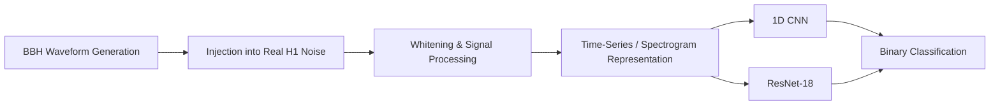
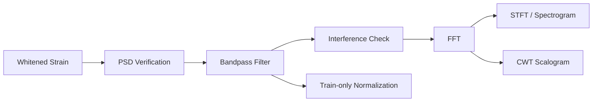

# 🌌 Gravitational Wave Analysis

### AI-Powered Gravitational-Wave Detection from LIGO Data

An end-to-end machine-learning pipeline for detecting simulated **binary black-hole (BBH) gravitational-wave signals** buried in real detector noise. The project combines gravitational-wave data generation, signal processing, time-frequency analysis, and deep learning to distinguish between **GW signals and noise-only segments**.


---

## 🔭 Overview

Gravitational waves are extremely weak distortions in spacetime that are measured by kilometer-scale interferometers such as those operated by LIGO. Detecting these signals is challenging because the measured detector strain is dominated by noise.

This project investigates whether deep-learning models can learn to distinguish gravitational-wave signals from detector noise.

The pipeline consists of four major stages:



The two classes are:

| Label | Class              | Description                                            |
| ----- | ------------------ | ------------------------------------------------------ |
| `0`   | Noise              | Real detector noise without an injected GW signal      |
| `1`   | Gravitational Wave | Simulated BBH signal injected into real detector noise |

---

## 🎯 Objectives

The project aims to:

* Generate a controlled dataset of simulated BBH gravitational-wave signals.
* Inject simulated signals into real LIGO Hanford (`H1`) detector noise.
* Control the signal-to-noise ratio (SNR) distribution.
* Prevent template leakage between training, validation, and test sets.
* Apply gravitational-wave signal-processing techniques such as whitening and bandpass filtering.
* Represent signals in both time and time-frequency domains.
* Compare a custom **1D CNN** with an **ImageNet-pretrained ResNet-18**.
* Evaluate models using AUC, accuracy, precision, recall, F1-score, and confusion matrices.

---

# 🧬 1. Dataset Generation

Dataset generation is implemented in:

```text
data/
└── data_synthesis.ipynb
```

The simulated waveforms are generated using **PyCBC** with the:

```text
IMRPhenomD
```

approximant.

### Waveform configuration

* Detector: `H1`
* Sampling rate: `4096 Hz`
* Duration: `1 second`
* Samples per example: `4096`
* Number of BBH templates: `80`
* Component masses: approximately `20–75 M☉`
* Maximum mass ratio: `8`
* Waveform approximant: `IMRPhenomD`

The waveform starting frequency is adjusted between approximately `50–120 Hz` so that the useful waveform remains practical within the one-second window.

### SNR distribution

The dataset deliberately contains a mixture of SNR ranges:

| SNR range | Approx. proportion |
| --------- | -----------------: |
| 8–14      |                55% |
| 14–20     |                30% |
| 20–30     |                15% |

This places greater emphasis on lower-SNR examples, where detection is more difficult.

---

## 🌊 Injection into Real Detector Noise

The simulated waveforms are injected into real open LIGO Hanford detector data obtained through the **GWOSC/GWpy** ecosystem.

The pipeline:

1. Retrieves real detector strain.
2. Selects suitable detector-data segments.
3. Removes windows around known gravitational-wave events.
4. Generates BBH waveforms.
5. Scales the waveform to the desired SNR.
6. Places the waveform at a randomized position within the one-second window.
7. Adds the waveform to the real detector noise.

This produces realistic examples of:

```text
real detector noise
        +
simulated gravitational-wave signal
        ↓
GW + noise sample
```

while noise-only examples contain only detector noise.

---

# 🧪 2. Template-Disjoint Dataset Splitting

A particularly important design choice is that the train, validation, and test sets are separated by **waveform template**, not simply by randomly splitting individual samples.

The 80 templates are divided into:

```text
56 templates → Training
12 templates → Validation
12 templates → Testing
```

Each template produces multiple examples.

The resulting dataset contains:

| Split      |    Total |       GW |    Noise |
| ---------- | -------: | -------: | -------: |
| Train      |     3920 |     2800 |     1120 |
| Validation |      840 |      600 |      240 |
| Test       |      840 |      600 |      240 |
| **Total**  | **5600** | **4000** | **1600** |

### Why template-disjoint splitting?

If examples generated from the same waveform template appeared in both training and testing, a model could partially memorize waveform-specific characteristics.

Template-disjoint evaluation therefore provides a stronger test of whether the model can generalize to **unseen binary-black-hole parameter combinations**.

---

# ⚙️ 3. Signal Processing

Signal processing is implemented in:

```text
signal_processing/
└── gw_signal_processing.ipynb
```

The notebook operates on the already-whitened dataset while maintaining separate train, validation, and test splits.

### Processing pipeline




### Time-frequency representations

The project explores:

* FFT
* Short-Time Fourier Transform (STFT)
* Spectrograms
* Continuous Wavelet Transform (CWT)

The STFT is particularly useful because a BBH merger produces a characteristic **chirp**, where the dominant frequency increases rapidly with time.

---

# 🖼️ 4. Spectrogram Representation

The ResNet model operates on spectrograms with dimensions:

```text
129 × 125
```

The spectrogram dataset contains:

```text
Train: 3920
Validation: 840
Test: 840
```

Normalization statistics are calculated **using the training set only**:

```text
Mean = -8.5208569
Std  =  3.3550611
```

The same statistics are then applied to validation and test data.

This prevents information from the validation/test sets from influencing preprocessing.

---

# 🤖 5. Machine Learning

Machine-learning experiments are contained in:

```text
machine_learning/
├── notebookA.ipynb
└── notebook_resnet.ipynb
```

Two different approaches are investigated.

---

## 🧠 Model A — Custom 1D CNN

The first model operates directly on the one-dimensional strain time series.

### Input

```text
1 × 4096
```

representing one second of detector strain sampled at 4096 Hz.

### Architecture

```text
Input
  │
  ├── Conv1D: 1 → 32
  ├── BatchNorm
  ├── ReLU
  ├── MaxPool
  └── Dropout
        │
        ├── Conv1D: 32 → 64
        ├── BatchNorm
        ├── ReLU
        ├── MaxPool
        └── Dropout
              │
              ├── Conv1D: 64 → 128
              ├── BatchNorm
              ├── ReLU
              ├── MaxPool
              └── Dropout
                    │
                  Flatten
                    │
                Linear → 64
                    │
                 ReLU
                    │
                Linear → 2
```

Dropout:

```text
0.2
```

### Training

* Optimizer: Adam
* Learning rate: `1e-3`
* Batch size: `64`
* Maximum epochs: `80`
* Gradient clipping: `1.0`
* Learning-rate scheduler: `ReduceLROnPlateau`
* Early stopping based on validation AUC
* `WeightedRandomSampler` used to address class imbalance during training

---

## 📊 1D CNN Results

The best validation AUC was:

```text
0.550
```

Final test performance:

| Metric    |     Score |
| --------- | --------: |
| Test Loss |    0.7306 |
| Accuracy  |     0.324 |
| AUC       | **0.538** |
| F1        |     0.142 |
| Precision |     0.758 |
| Recall    | **0.078** |

Confusion matrix:

```text
                 Predicted
                Noise    GW
Actual Noise     225     15
Actual GW        553     47
```

The model therefore struggled to learn sufficiently discriminative features directly from the raw one-dimensional strain representation.

---

# 🖥️ Model B — ImageNet-Pretrained ResNet-18

The second approach converts the gravitational-wave data into spectrograms and treats them as images.

A pretrained **ResNet-18** is used as the feature extractor.

Because ResNet-18 expects three input channels while the spectrogram is single-channel, the spectrogram is repeated:

```text
1 channel → 3 channels
```

The original ImageNet classification layer is replaced with:

```text
Dropout(0.2)
      ↓
Linear(512 → 2)
```

### Training configuration

* Model: ImageNet-pretrained ResNet-18
* Optimizer: Adam
* Learning rate: `1e-4`
* Weight decay: `1e-5`
* Batch size: `64`
* Maximum epochs: `80`
* Loss: weighted cross-entropy
* Scheduler: `ReduceLROnPlateau`
* Early stopping
* Primary model-selection metric: validation AUC
* Random seed: `42`

Class weights:

```text
Noise = 1.75
GW    = 0.70
```

---

# 📈 ResNet-18 Results

The best validation AUC was:

```text
0.9963
```

at epoch 3.

The selected AUC-based model achieved:

| Metric    | Test Score |
| --------- | ---------: |
| Loss      |     0.6707 |
| Accuracy  | **85.24%** |
| AUC       | **0.9923** |
| F1        | **0.8850** |
| Precision | **0.9979** |
| Recall    | **0.7950** |

Confusion matrix:

```text
                 Predicted
                Noise    GW
Actual Noise     239      1
Actual GW        123    477
```

The extremely high precision indicates that the model produced very few false gravitational-wave detections, while its recall shows that there is still room to improve the number of true signals detected.

---

# ⚖️ Model Comparison

| Model         | Representation |   Test AUC |   Accuracy |  Precision |     Recall |        F1 |
| ------------- | -------------- | ---------: | ---------: | ---------: | ---------: | --------: |
| Custom 1D CNN | Raw strain     |      0.538 |      32.4% |      75.8% |       7.8% |     0.142 |
| **ResNet-18** | Spectrogram    | **0.9923** | **85.24%** | **99.79%** | **79.50%** | **0.885** |

### Key observation

The two models demonstrate a major difference in representation quality.

The 1D CNN attempts to learn discriminative features directly from the time-domain strain. Its near-random AUC indicates that this representation was difficult for the model to exploit effectively under the current experimental setup.

The spectrogram-based ResNet, on the other hand, has access to the **time-frequency structure of the chirp**, making the characteristic evolution of the gravitational-wave signal much easier to identify.

> **The results suggest that an appropriate representation of gravitational-wave data can be as important as the choice of neural-network architecture itself.**

---

# 📁 Repository Structure

```text
Gravitational-Wave-Analysis/
│
├── data/
│   └── data_synthesis.ipynb
│
├── signal_processing/
│   └── gw_signal_processing.ipynb
│
├── machine_learning/
│   ├── notebookA.ipynb
│   └── notebook_resnet.ipynb
│
├── Report.pdf
│
└── README.md
```

### Directory description

| Path                 | Purpose                                                                |
| -------------------- | ---------------------------------------------------------------------- |
| `data/`              | Synthetic GW dataset generation and injection into real detector noise |
| `signal_processing/` | Whitening verification, filtering, FFT, STFT, CWT and preprocessing    |
| `machine_learning/`  | 1D CNN and ResNet-18 experiments                                       |
| `Report.pdf`         | Detailed project report                                                |
| `README.md`          | Project documentation                                                  |

---

# 🛠️ Technologies Used

### Gravitational-wave analysis

* [GWOSC](https://gwosc.org/)
* [GWpy](https://gwpy.github.io/)
* [PyCBC](https://pycbc.org/)

### Scientific computing

* NumPy
* Pandas
* SciPy
* PyWavelets
* h5py
* Matplotlib

### Machine learning

* PyTorch
* Torchvision
* Scikit-learn

---

# 🚀 Running the Project

The notebooks were developed primarily in a **Kaggle GPU environment**.

Install the core gravitational-wave dependencies with:

```bash
pip install gwosc gwpy pycbc
```

The machine-learning notebooks additionally require:

```bash
pip install numpy pandas scipy h5py matplotlib PyWavelets
pip install torch torchvision scikit-learn
```

Then run the notebooks in the following order:

```text
1. data/data_synthesis.ipynb
        ↓
2. signal_processing/gw_signal_processing.ipynb
        ↓
3. machine_learning/notebookA.ipynb
        ↓
4. machine_learning/notebook_resnet.ipynb
```

### ⚠️ Data-path note

The notebooks currently contain environment-specific paths such as:

```text
/kaggle/working/...
/kaggle/input/...
```

and the ResNet experiment loads a spectrogram HDF5 dataset from a Kaggle dataset.

Therefore, before running the notebooks outside Kaggle, update the HDF5 paths to point to your local dataset.

The repository currently does **not** include the large HDF5 datasets themselves.

---

# 🔬 Experimental Design

A major focus of the project is avoiding data leakage.

The pipeline maintains separate:

```text
TRAIN
  ↓
VALIDATION
  ↓
TEST
```

sets throughout processing.

Where statistics must be learned from data, such as normalization parameters, they are calculated using **training data only**.

For example:

```python
mean = train.mean()
std = train.std()
```

and the same values are then applied to:

```text
train
validation
test
```

This ensures that information from the test set does not influence model development.

---

# 🧩 Why Spectrograms?

A gravitational-wave signal from a compact binary merger has a distinctive time-frequency evolution.

In the time domain, the signal can be difficult to distinguish from detector noise.

In the frequency domain, however, the merger produces a characteristic chirp:

```text
Frequency
   ↑
   │                 /
   │              _/
   │           __/
   │        __/
   │_____ _/
   └──────────────────→ Time
```

A spectrogram makes this structure explicitly visible.

This creates a natural connection between:

```text
Physics
   ↓
Gravitational-wave chirp
   ↓
Time-frequency representation
   ↓
Image-based deep learning
   ↓
Signal classification
```

---

# 📌 Limitations

Although the ResNet model performs strongly on the current test set, several limitations remain.

### 1. Simulated signals

The positive examples are primarily simulated BBH waveforms injected into real detector noise rather than a large collection of independently confirmed astrophysical events.

### 2. Limited waveform diversity

The template bank varies component masses and mass ratio, while spin and eccentricity are not comprehensively varied.

### 3. Single-detector analysis

The current classification experiment focuses on LIGO Hanford (`H1`).

A real detection pipeline would benefit from combining information from multiple detectors such as Hanford, Livingston, and Virgo/KAGRA.

### 4. SNR distribution

The dataset focuses mainly on SNR values between approximately 8 and 30.

Performance at much lower SNRs requires further investigation.

### 5. Dataset availability

The large HDF5 datasets are not stored in the repository, and some experiments depend on Kaggle-specific paths.

### 6. Recall

The ResNet model achieves extremely high precision but approximately **79.5% recall**, meaning some simulated GW signals are still missed.

For an actual detection system, maximizing sensitivity while controlling false alarms would be critical.

---

# 🚀 Future Work

Potential extensions include:

* Incorporating confirmed real gravitational-wave events.
* Increasing waveform diversity.
* Including binary spins and eccentricity.
* Expanding the mass and SNR ranges.
* Training on multiple detector channels.
* Exploring H1 + L1 coincident detection.
* Comparing additional time-frequency representations.
* Using CWT scalograms as model input.
* Investigating spectrogram augmentation.
* Hyperparameter optimization.
* Improving low-SNR detection.
* Optimizing the decision threshold for higher recall.
* Evaluating false-alarm rates.
* Testing against non-Gaussian detector glitches.
* Exploring architectures specifically designed for gravitational-wave time series.

---

# 📚 References

The project builds upon resources and software from:

* **LIGO Scientific Collaboration**
* **Gravitational Wave Open Science Center (GWOSC)**
* **PyCBC**
* **GWpy**
* **PyTorch / Torchvision**

Useful resources:

* LIGO: https://www.ligo.org/
* GWOSC: https://gwosc.org/
* PyCBC: https://pycbc.org/
* GWpy: https://gwpy.github.io/
* PyTorch: https://pytorch.org/

---

# 👩‍💻 Author

**Tanvika Ojha**

B.Tech — Engineering Physics
Indian Institute of Technology (ISM) Dhanbad

---

## ⭐ Project Highlights

* 🌀 Simulated **binary black-hole gravitational waves**
* 📡 Real **LIGO Hanford detector noise**
* 🧪 Controlled **SNR-based data generation**
* 🔒 **Template-disjoint** train/validation/test split
* ⚙️ Gravitational-wave signal processing
* 📈 FFT, STFT and CWT analysis
* 🧠 Custom **1D CNN**
* 🖼️ Spectrogram-based **ResNet-18**
* 🎯 **0.9923 test AUC**
* 🎯 **99.79% test precision**
* 🔬 Physics-informed machine-learning workflow

---

> **From spacetime ripples to deep learning — this project explores how the time-frequency structure of gravitational waves can be exploited for automated signal detection.**
